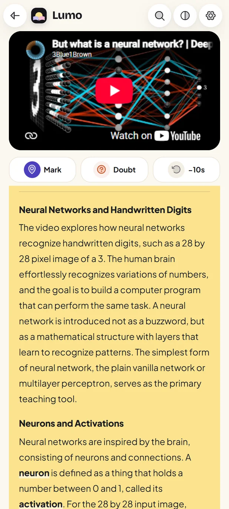
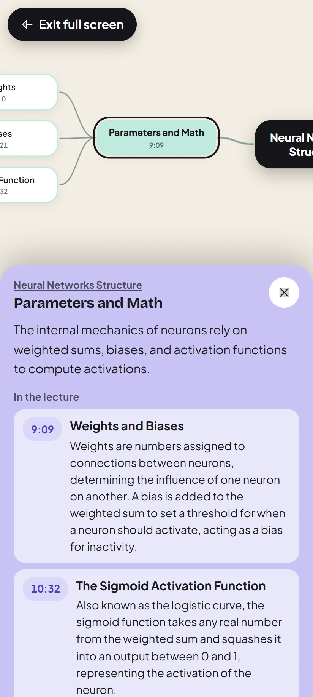
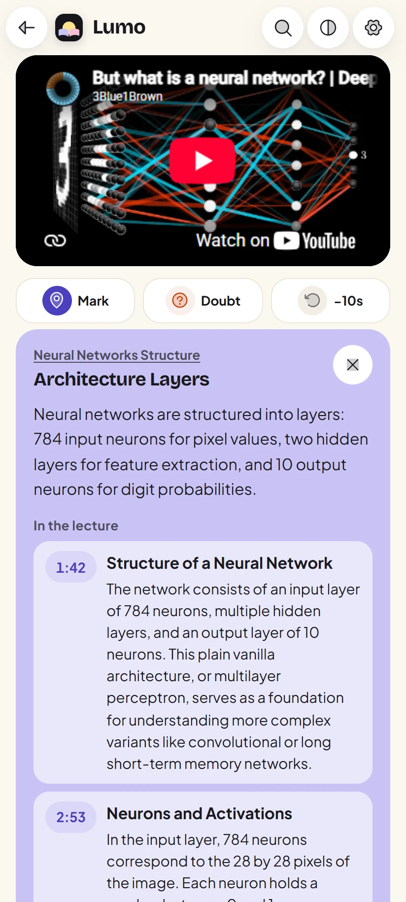
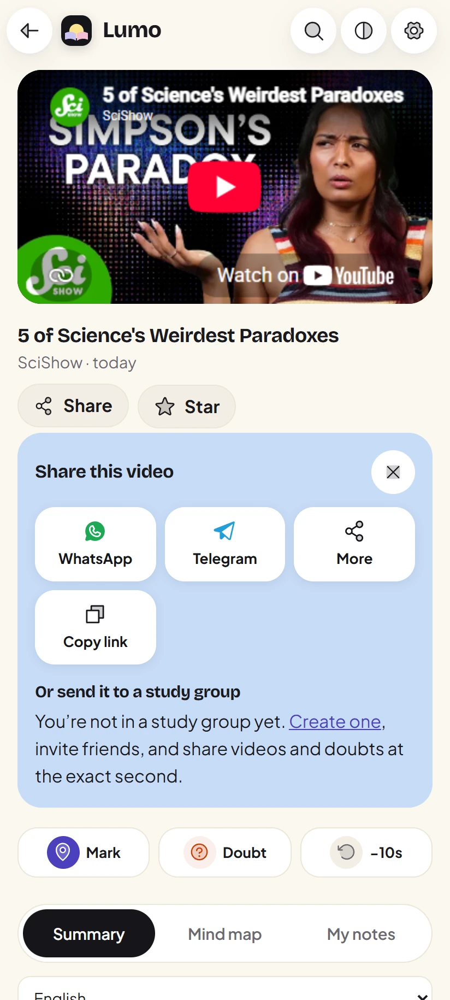
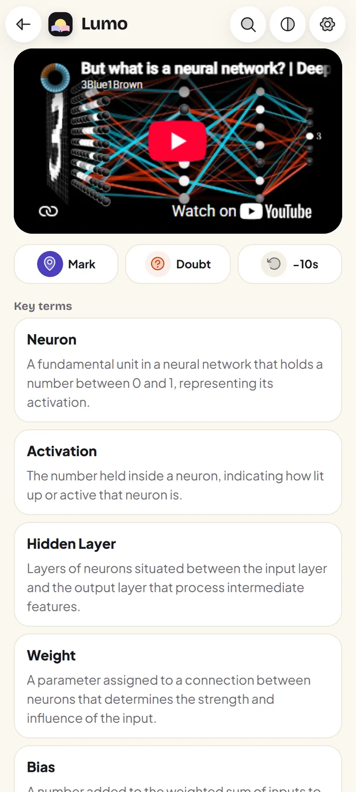
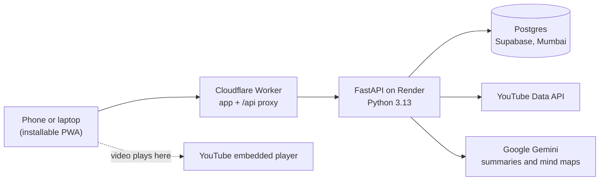

<a href="https://focuslearn.focuslearn.workers.dev">
  <picture>
    <source media="(prefers-color-scheme: dark)" srcset="docs/brand/banner-dark.webp">
    
  </picture>
</a>

<p align="center">
  <a href="https://focuslearn.focuslearn.workers.dev"></a>
  &nbsp;
  <a href="#install-in-10-seconds"></a>
</p>

<p align="center">
  Free &nbsp;·&nbsp; Works on Android, iPhone and laptops &nbsp;·&nbsp; No ads, no feed of distractions
</p>

---

## YouTube has the best free lessons in the world. It also has everything built to pull you away from them.

Lumo keeps the lessons and drops the rest. Tell it what you're learning and it fills your home with lectures, explainers, podcasts and interviews on that. Open any video and you get a summary, detailed study notes, key terms and a mind map of the whole thing, with every idea linked to the second it's taught. Write your own notes beside the player, park doubts at the exact moment, and work through them with friends in a study group.

Every video plays through YouTube's own player, so creators keep their views and nothing about the video is changed.

---

## A tour

<table>
  <tr>
    <td width="50%" valign="top">
      <h3>Read the video before you watch it</h3>
      <p>A summary that covers the whole video, then <b>Brief summary</b>: real study notes in sections, with the definitions, steps, examples and numbers as the teacher gave them, and key terms in bold. Lectures, podcasts and interviews up to 6 hours, in English or Hindi.</p>
      <p><b>Key terms</b> lists every term with its meaning. <b>Test yourself</b> turns the key points into recall cards: say the idea, then reveal it.</p>
    </td>
    <td width="25%"></td>
    <td width="25%"></td>
  </tr>
  <tr>
    <td width="25%"></td>
    <td width="25%"></td>
    <td width="50%" valign="top">
      <h3>See the whole lecture as a mind map</h3>
      <p>The main idea in the middle, its branches on both sides, a colour per branch. Tap any idea for its card: where it sits, what it means, the lecture's key points on it with their times, and its sub-ideas. <b>Play from here</b> jumps the video to that second.</p>
      <p>While the video plays, the idea being taught right now lights up on the map.</p>
    </td>
  </tr>
  <tr>
    <td width="50%" valign="top">
      <h3>Study together, at the exact second</h3>
      <p>Make a group, invite friends with a link, and share a video or a doubt at the moment it confused you. Talk it through in a thread; whoever asked marks it answered. Members see the name you pick for each group, never your email.</p>
      <p>Or send any video to WhatsApp or Telegram in one tap. Friends land on it in Lumo, with its summary.</p>
    </td>
    <td width="25%"></td>
    <td width="25%"></td>
  </tr>
  <tr>
    <td width="25%"></td>
    <td width="25%"></td>
    <td width="50%" valign="top">
      <h3>A home that is only about what you're learning</h3>
      <p>Set a goal like "CA Inter costing" or "machine learning for beginners" and Home fills with videos for it, plus podcasts and interviews. Songs, games and comedy are off from the start; switch any of them back on in Settings. Shorts come only from channels you follow.</p>
      <p>Your notepad sits beside the player, with highlights, coloured underlines, pasted screenshots and time stamps that jump back to the moment.</p>
    </td>
  </tr>
</table>

<p align="center">
  
</p>

---

## Install in 10 seconds

Lumo is a web app you install straight from the browser: no store, a small download, and it updates itself.

| Your device | How |
|---|---|
| **Android** | Open **[focuslearn.focuslearn.workers.dev](https://focuslearn.focuslearn.workers.dev)** in Chrome and tap **Install the app** on the welcome page (or ⋮ → *Install app*). Lumo gets its own icon and opens full screen. |
| **iPhone / iPad** | Open the link in Safari, tap **Share**, then **Add to Home Screen**. |
| **Laptop** | Open the link in Chrome or Edge and click the install icon at the right end of the address bar. |

Sign in with Google or an email. Lumo is for adults (18+).

---

## Built around the rules

Lumo follows YouTube's API policies and India's DPDP Act. The full rule table is in [docs/plan.md](docs/plan.md).

| Rule | What it means in practice |
|---|---|
| A video's type comes only from YouTube's own fields | Filters read `categoryId` and `topicDetails`. No title, description or AI ever judges a video. |
| YouTube data is kept for 30 days at most | A purge job deletes cached videos, searches, comments and summaries after 30 days. |
| Nothing covers the player, thumbnails are never altered | Panels open in the page below the player; the full-screen mind map pauses the video first. |
| No streaks, points or rewards for watching | Recall cards keep no score. |
| Video IDs and searches stay out of URLs and logs | They travel in request bodies; logs hold route templates only. |
| Adults only | The date of birth is checked once at sign-up and never stored. |

---

## How it works



- **Summaries are made once per video and language**, then shared by everyone who opens it. Long videos are read in 15-minute parts, two at a time; finished parts are kept, busy answers are retried in seconds, and a final pass turns the parts into one set of notes for the whole video.
- **One address for everything.** Phones only talk to the Cloudflare address; the Worker passes `/api` on to the server and wakes it every 10 minutes, so nobody waits for it to start.
- **Quick on a slow phone.** Screens load on demand and preload while the phone is idle; each screen remembers what it last showed and redraws at once when you come back.
- **Search is cached** and shares a fixed daily quota; when it runs out, saved results still answer.

<details>
<summary><b>For developers: stack, running it locally, tests</b></summary>

### Stack

| Part | Choice |
|---|---|
| App | React 19, TypeScript, Vite 8, React Router 7, vite-plugin-pwa |
| Notepad and mind map | TipTap and React Flow (`@xyflow/react`), each loaded only when opened |
| Look | Hand-written CSS on design tokens (`frontend/src/styles/pastel.css`), Bricolage Grotesque and Plus Jakarta Sans, Phosphor icons |
| Server | FastAPI, SQLAlchemy 2, Alembic, uv |
| Data | PostgreSQL on Supabase |
| AI | Google Gemini for summaries and mind maps, Groq for goal topics |
| Hosting | Cloudflare Workers (app), Render (server), Supabase (database), all on free plans |

### Run it locally

You need Python 3.13 with [uv](https://docs.astral.sh/uv/), Node 22 and a Postgres database.

```bash
# server
cd backend
cp .env.example .env          # fill in the keys it lists
uv run alembic upgrade head
uv run uvicorn app.main:app --port 8000

# app, in a second terminal
cd frontend
npm install
npx vite --port 5173          # sends /api to localhost:8000
```

To work on the screens against the live server, start the app with `API_PROXY=https://focuslearn.focuslearn.workers.dev npx vite`.

### Tests

```bash
cd backend && uv run pytest -q                                # API and rule tests, against a fake YouTube
cd frontend && npx tsc -b && npm run lint && npx vitest run   # app tests
cd frontend && node e2e/audit.mjs                             # every screen: phone and laptop, day and night
```

The audit checks every screen for a sticky top bar, the tab bar's place, sideways scroll, unnamed buttons, small tap targets, missing alt text and a single `h1`. The other `e2e/` scripts walk the main flows in a real browser with throwaway accounts that are always deleted; `e2e/readme-shots.mjs` and `e2e/readme-banner.mjs` make the images on this page.

### Layout

| Folder | What's in it |
|---|---|
| `backend/app/` | API routes, the YouTube client, feed and search, AI summary jobs, the purge job |
| `frontend/src/` | Pages, components, the API client and the design tokens |
| `frontend/worker/` | The Cloudflare Worker |
| `frontend/e2e/` | Browser flows, the screen audit, and the README image builders |
| `docs/` | The plan, the policy research behind each rule, and design reviews |

</details>

<p align="center">
  <br>
  <a href="https://focuslearn.focuslearn.workers.dev"></a>
  <br><br>
  <sub>Made in India, for anyone learning from YouTube.</sub>
</p>
