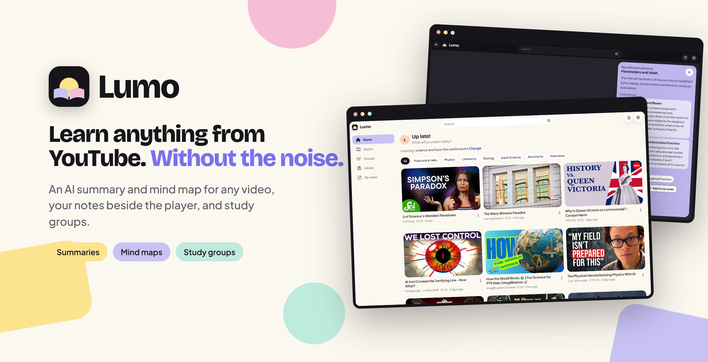
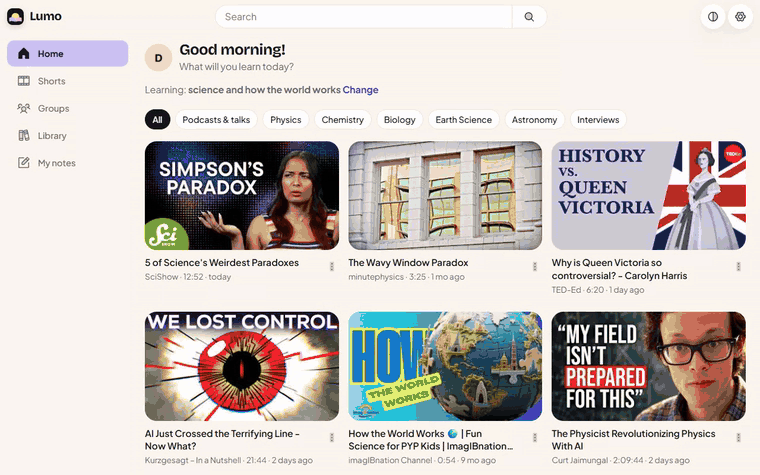
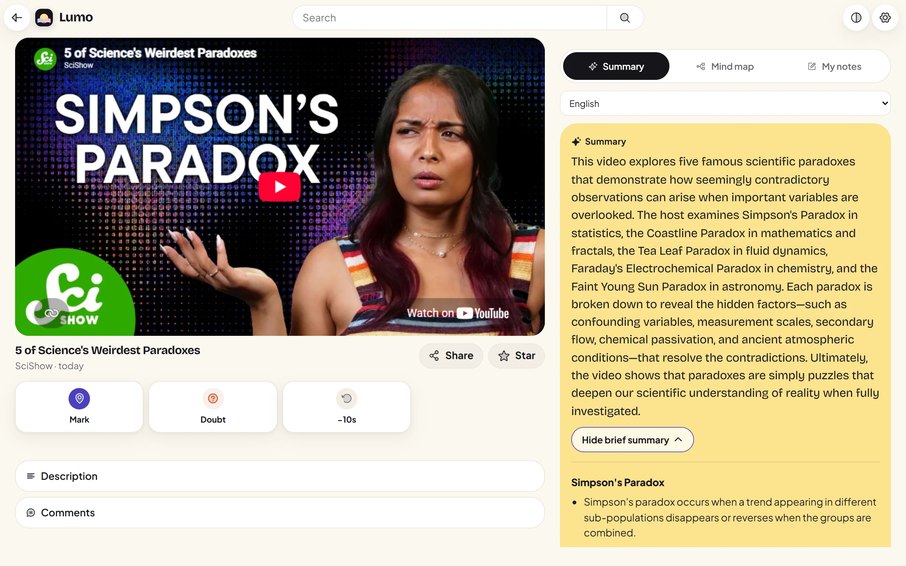
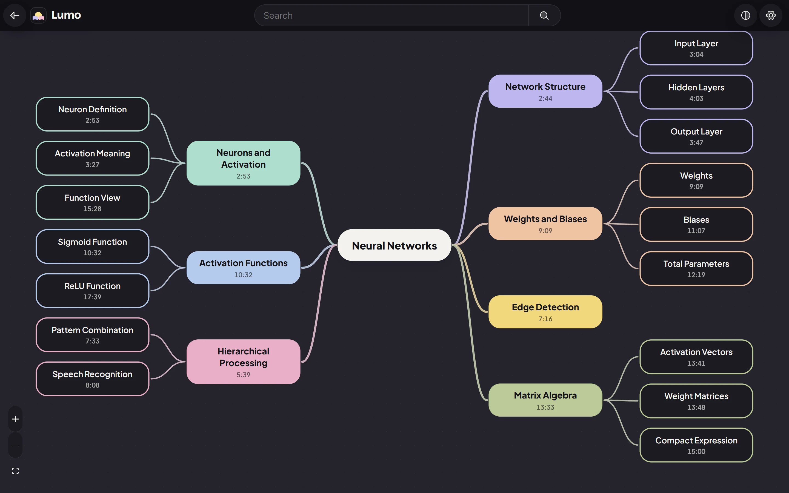
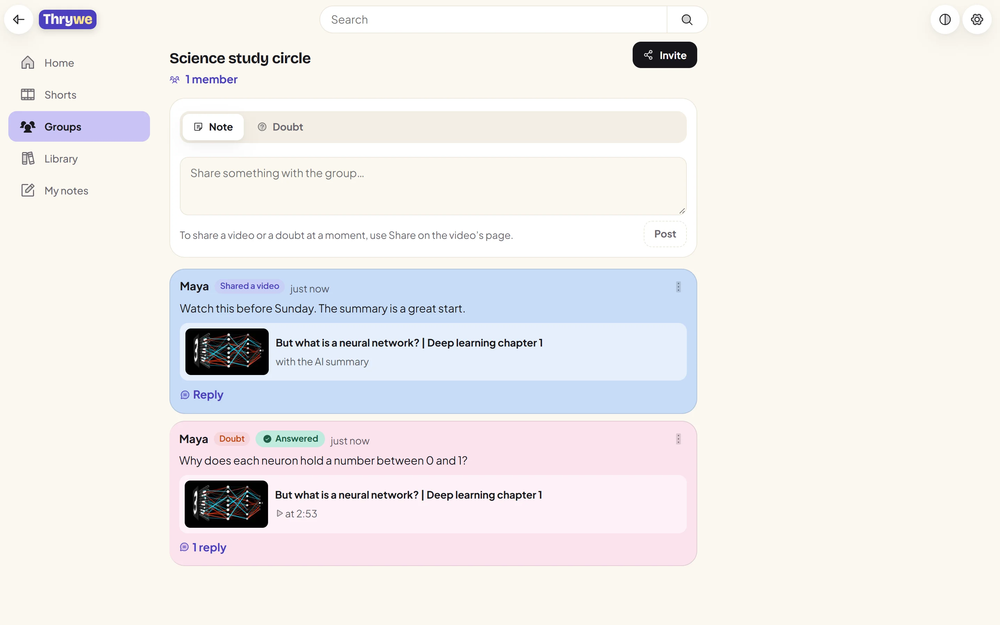
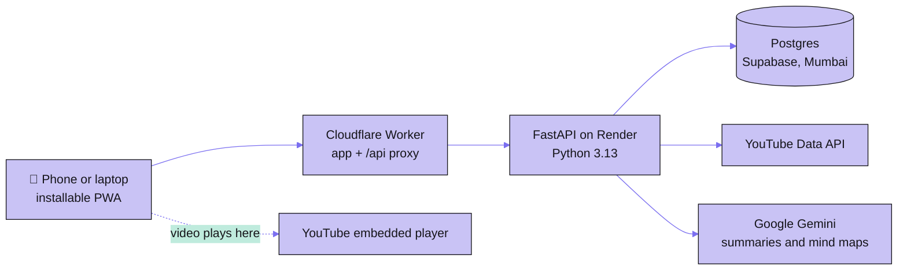

<a href="https://thrywe.focuslearn.workers.dev">
  <picture>
    <source media="(prefers-color-scheme: dark)" srcset="docs/brand/banner-dark.webp">
    
  </picture>
</a>

<p align="center">
  <a href="https://thrywe.focuslearn.workers.dev"></a>
  &nbsp;
  <a href="#install-in-10-seconds"></a>
</p>

<p align="center">
  
  
  
  
</p>

<p align="center">
  <a href="#see-it-in-20-seconds">Demo</a> &nbsp;·&nbsp;
  <a href="#what-you-get">Features</a> &nbsp;·&nbsp;
  <a href="#install-in-10-seconds">Install</a> &nbsp;·&nbsp;
  <a href="#questions">FAQ</a> &nbsp;·&nbsp;
  <a href="#how-it-works">How it works</a>
</p>

---

### YouTube has the best free lessons in the world, right next to everything built to pull you away from them.

**Thrywe keeps the lessons and drops the rest.** Tell it what you're learning and Home fills with lectures, explainers, podcasts and interviews on that. Open any video and you get a summary, study notes, key terms and a mind map of the whole thing, every idea linked to the second it's taught. Write your own notes beside the player, park doubts at the exact moment, and work through them with friends.

Every video plays through YouTube's own player, so creators keep their views and nothing about the video is changed.

## See it in 20 seconds

<p align="center">
  
</p>

<p align="center"><sub>Home → a video's summary and study notes → the mind map → an idea's card.</sub></p>

## What you get

### 📝 Summaries and study notes for any video

A summary that covers the whole video, then **Brief summary**: study notes in sections, with the definitions, steps, examples and numbers as the teacher gave them. **Key terms** explains every term, and **Test yourself** turns the key points into recall cards. Lectures, podcasts and interviews up to 6 hours, in English or Hindi.

<p align="center">
  
</p>

### 🧠 The whole lecture as a mind map

The main idea in the middle, branches on both sides, a colour per branch. Tap an idea to see what it means, the lecture's points on it with their times, and **Play from here**. While the video plays, the idea being taught right now lights up.

<p align="center">
  
</p>

### 👥 Study groups that talk about the exact second

Invite friends with a link, share a video or a doubt at the moment it confused you, and talk it through in a thread. Or send any video to WhatsApp or Telegram in one tap.

<p align="center">
  
</p>

**Also inside:** a Home that shows only what you're learning (songs, games and comedy are off from the start), your own notepad beside the player, Mark and Doubt at the current second, Shorts only from channels you follow, and night mode.

## Install in 10 seconds

Thrywe installs straight from the browser: no store, a small download, and it updates itself.

| Your device | How |
|---|---|
| **Android** | Open **[thrywe.focuslearn.workers.dev](https://thrywe.focuslearn.workers.dev)** in Chrome and tap **Install the app** on the welcome page (or ⋮ → *Install app*). Thrywe gets its own icon and opens full screen. |
| **iPhone / iPad** | Open the link in Safari, tap **Share**, then **Add to Home Screen**. |
| **Laptop** | Open the link in Chrome or Edge and click the install icon at the right end of the address bar. |

Then sign in with Google or an email. Thrywe is for adults (18+).

## Questions

<details>
<summary><b>Is it really free?</b></summary>
<br>
Yes. No ads, no paid plan, no card. Thrywe runs on free tiers; if summaries are very busy on a given day, a new one may wait until the next day, and the page says so.
</details>

<details>
<summary><b>Does Thrywe download or copy YouTube videos?</b></summary>
<br>
No. Videos play only through YouTube's own embedded player, with YouTube's title and thumbnail exactly as YouTube shows them. Creators keep their views.
</details>

<details>
<summary><b>Which videos get a summary and mind map?</b></summary>
<br>
Any public video up to 6 hours: lectures, tutorials, podcasts and interviews. The first person to open a video taps <b>Generate summary</b> (about a minute; long videos show their progress), and from then on it opens at once for everyone.
</details>

<details>
<summary><b>What does Thrywe keep about me?</b></summary>
<br>
Your email, the goal and settings you choose, what you write (notes, doubts, notepad, group posts) and where you stopped in each video. Your date of birth is checked once and never stored. YouTube data is deleted after 30 days. Nothing you type is sent to the AI. You can delete everything in one tap in Settings.
</details>

<details>
<summary><b>Does it work offline?</b></summary>
<br>
The app opens without a connection, and summaries you've opened are kept on your phone for 30 days, so you can revise on the train. Videos need the internet, since they play from YouTube.
</details>

<details>
<summary><b>I found a bug or have an idea.</b></summary>
<br>
In the app, go to <b>Settings → Send feedback</b>, or open an issue on this repository.
</details>

## Built around the rules

Thrywe follows YouTube's API policies and India's DPDP Act. The full rule table is in [docs/RULES.md](docs/RULES.md).

| Rule | What it means in practice |
|---|---|
| A video's type comes only from YouTube's own fields | Filters read `categoryId` and `topicDetails`. No title, description or AI ever judges a video. |
| YouTube data is kept for 30 days at most | A purge job deletes cached videos, searches, comments and summaries after 30 days. |
| Nothing covers the player, thumbnails are never altered | Panels open in the page below the player; the full-screen mind map pauses the video first. |
| No streaks, points or rewards for watching | Recall cards keep no score. |
| Video IDs and searches stay out of URLs and logs | They travel in request bodies; logs hold route templates only. |
| Adults only | The date of birth is checked once at sign-up and never stored. |

## How it works



- **Summaries are made once per video and language**, then shared by everyone who opens it. Long videos are read in 15-minute parts, two at a time; finished parts are kept, busy answers are retried in seconds, and a final pass turns the parts into one set of notes for the whole video.
- **One address for everything.** Phones only talk to the Cloudflare address; the Worker passes `/api` on to the server and wakes it every 10 minutes, so nobody waits for it to start.
- **Quick on a slow phone.** Screens load on demand and preload while the phone is idle; each screen remembers what it last showed and redraws at once when you come back.
- **Search is cached** and shares a fixed daily quota; when it runs out, saved results still answer.

<details>
<summary><b>For developers: stack, running it locally, tests</b></summary>

### Stack

| Part | Choice |
|---|---|
| App | React 19, TypeScript, Vite 8, React Router 7, vite-plugin-pwa |
| Notepad and mind map | TipTap and React Flow (`@xyflow/react`), each loaded only when opened |
| Look | Hand-written CSS on design tokens (`frontend/src/styles/pastel.css`), Bricolage Grotesque and Plus Jakarta Sans, Phosphor icons |
| Server | FastAPI, SQLAlchemy 2, Alembic, uv |
| Data | PostgreSQL on Supabase |
| AI | Google Gemini for summaries and mind maps, Groq for goal topics |
| Hosting | Cloudflare Workers (app), Render (server), Supabase (database), all on free plans |

### Run it locally

You need Python 3.13 with [uv](https://docs.astral.sh/uv/), Node 22 and a Postgres database.

```bash
# server
cd backend
cp .env.example .env          # fill in the keys it lists
uv run alembic upgrade head
uv run uvicorn app.main:app --port 8000

# app, in a second terminal
cd frontend
npm install
npx vite --port 5173          # sends /api to localhost:8000
```

To work on the screens against the live server, start the app with `API_PROXY=https://thrywe.focuslearn.workers.dev npx vite`.

### Tests

```bash
cd backend && uv run pytest -q                                # API and rule tests, against a fake YouTube
cd frontend && npx tsc -b && npm run lint && npx vitest run   # app tests
cd frontend && node e2e/audit.mjs                             # every screen: phone and laptop, day and night
```

The audit checks every screen for a sticky top bar, the tab bar's place, sideways scroll, unnamed buttons, small tap targets, missing alt text and a single `h1`. The other `e2e/` scripts walk the main flows in a real browser with throwaway accounts that are always deleted. `e2e/readme-shots.mjs`, `e2e/readme-banner.mjs` and `e2e/readme-demo.mjs` make the images and the demo on this page.

### Layout

| Folder | What's in it |
|---|---|
| `backend/app/` | API routes, the YouTube client, feed and search, AI summary jobs, the purge job |
| `frontend/src/` | Pages, components, the API client and the design tokens |
| `frontend/worker/` | The Cloudflare Worker |
| `frontend/e2e/` | Browser flows, the screen audit, and the README image builders |
| `docs/` | The rules every feature follows, curated exam topics, the goal format, and the images on this page |

</details>

## Made by

**Yashasvi Yadav** · [@yashasviyadav30](https://github.com/yashasviyadav30)

If Thrywe helps you learn, a ⭐ on this repository helps other learners find it.

© 2026 Yashasvi Yadav. All rights reserved. The code is public to read; please ask before reusing it.

<p align="center">
  <br>
  <a href="https://thrywe.focuslearn.workers.dev"></a>
  <br><br>
  <sub>Made in India, for anyone learning from YouTube.</sub>
</p>
