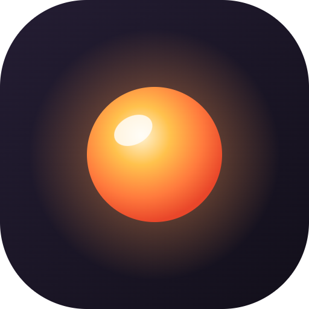
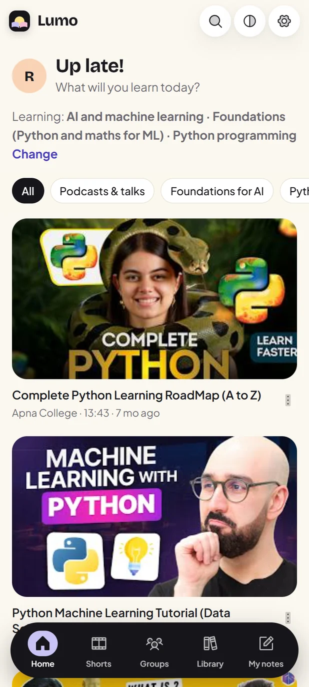
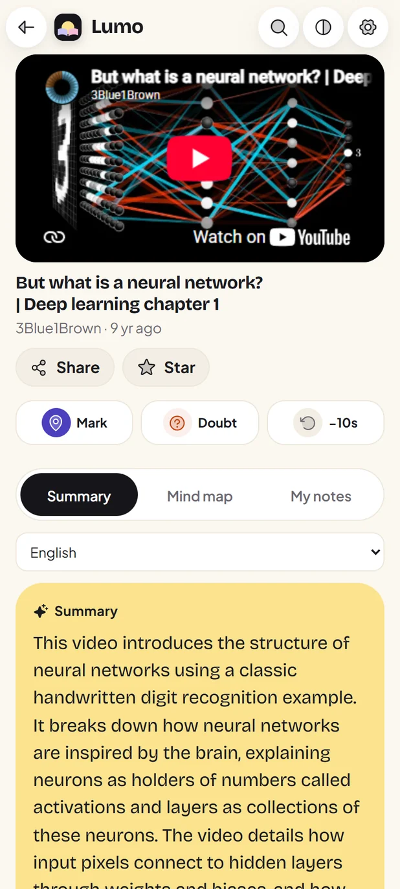
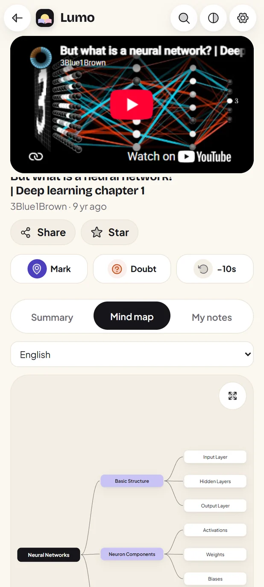
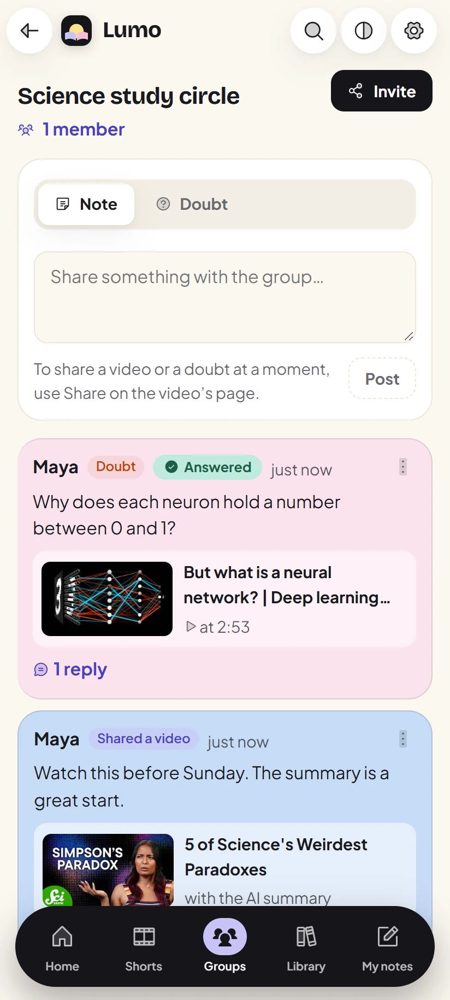
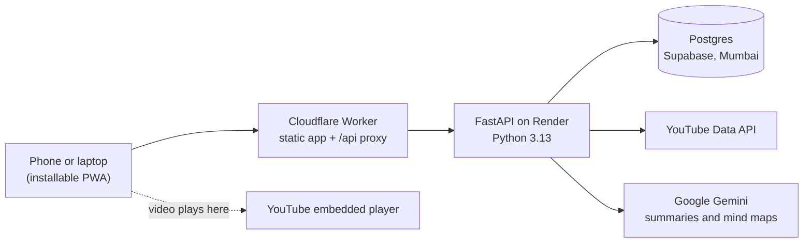
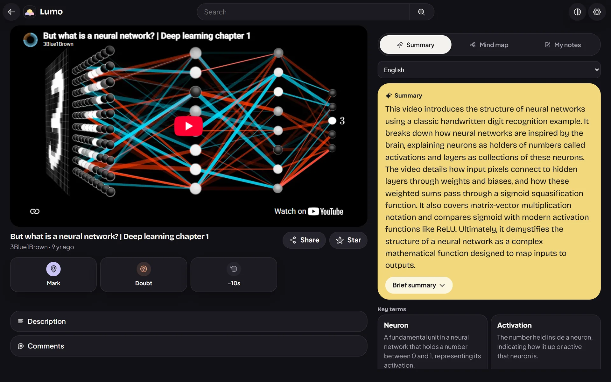

<p align="center">
  
</p>

<h1 align="center">Lumo</h1>

<p align="center">
  <b>Learn anything from YouTube, without the noise.</b><br>
  A calm home for the lessons on YouTube: an AI summary and mind map for any video, your own notepad beside the player, and study groups that talk about the exact second.
</p>

<p align="center">
  <a href="https://focuslearn.focuslearn.workers.dev"><b>Open the app</b></a>
  &nbsp;·&nbsp;
  <a href="#run-it-locally">Run it locally</a>
  &nbsp;·&nbsp;
  <a href="#how-it-works">How it works</a>
</p>

<p align="center">
  
  
  
  
  
</p>

<p align="center">
  
  
  
  
</p>

## Why

YouTube holds the best free lessons in the world, right next to everything built to pull you away from them. Lumo keeps the lessons and drops the rest. Every video plays through YouTube's own embedded player, so creators keep their views and nothing about the video is changed.

## What it does

**Home and Search**
- Tell Lumo what you're learning ("CA Inter costing", "spoken English") and Home fills with videos for it, plus podcasts and interviews.
- Songs, games and comedy are off from the start. Switch any of them back on in Settings. Creators you follow always show.
- Shorts come only from channels you follow, and your YouTube subscriptions import in one tap.

**Studying a video**
- **Summary:** a short summary first, then the brief summary and key points with tappable timestamps. Made by Google Gemini from the public video.
- **Test yourself:** each key point turns into a recall card. Say the idea, then reveal it. No scores, no streaks.
- **Mind map:** a zoomable map of the video's ideas. The idea being taught right now lights up as the video plays.
- **My notes:** a notepad beside the player, with highlights, coloured underlines, pasted screenshots and time stamps that jump back to the moment.
- **Mark and Doubt:** save the current second in one tap and come back to it later.
- Export the summary as a PDF, or share it to WhatsApp.

**Study groups**
- Invite friends with a link. Share a video, or a doubt at the exact second, and talk it through in a thread.
- The person who asked (or the group owner) marks a doubt answered.
- Members see the name you choose for each group, never your email.

## How it works



- **One address for everything.** Phones only ever talk to the Cloudflare address. The Worker passes `/api` on to the server, because some Indian mobile networks fail to reach `*.onrender.com`. It also wakes the free server every 10 minutes, so nobody waits for it to start.
- **A summary is made once per video and language**, then shared by everyone who opens that video. Jobs queue, retry and fall back to a second model when Gemini is busy. Long videos are summarised in one-hour parts.
- **Search is cached** and shares a fixed daily quota across the whole app. When the quota runs out, saved results still answer, with a note saying so.
- **Quick on a slow phone.** Screens load on demand and preload while the phone is idle. Each screen remembers what it last showed and redraws at once when you come back, then refreshes in the background.

## Rules it keeps

Lumo is built around YouTube's API policies and India's DPDP Act. The full rule table is in [docs/plan.md](docs/plan.md).

| Rule | What it means in the code |
|---|---|
| A video's type comes only from YouTube's own fields | Filters read `categoryId` and `topicDetails`. No title, description or AI ever judges a video. |
| YouTube data is kept for 30 days at most | A purge job deletes cached videos, searches, comments and summaries after 30 days. Reads ignore anything older. |
| Nothing covers the player, and thumbnails are never altered | Panels open in the page below the player. The full-screen mind map pauses the video first. |
| No streaks, points or rewards for watching | Recall cards keep no score. |
| Video IDs and searches stay out of URLs and logs | They travel in POST bodies. Logs hold route templates only. |
| Adults only (18+) | The date of birth is checked once at sign-up and never stored. |

## Tech stack

| Part | Choice |
|---|---|
| App | React 19, TypeScript, Vite 8, React Router 7, vite-plugin-pwa |
| Notepad and mind map | TipTap and React Flow (`@xyflow/react`), each loaded only when opened |
| Look | Hand-written CSS on design tokens, Bricolage Grotesque and Plus Jakarta Sans, Phosphor icons |
| Server | FastAPI, SQLAlchemy 2, Alembic, uv |
| Data | PostgreSQL on Supabase |
| AI | Google Gemini for summaries and mind maps, Groq for goal topics |
| Hosting | Cloudflare Workers (app), Render (server), Supabase (database), all on free plans |

## Run it locally

You need Python 3.13 with [uv](https://docs.astral.sh/uv/), Node 22 and a Postgres database.

```bash
# server
cd backend
cp .env.example .env          # fill in the keys it lists
uv run alembic upgrade head
uv run uvicorn app.main:app --port 8000

# app, in a second terminal
cd frontend
npm install
npx vite --port 5173          # sends /api to localhost:8000
```

To work on the screens against the live server, start the app with `API_PROXY=https://focuslearn.focuslearn.workers.dev npx vite`.

## Tests

```bash
cd backend && uv run pytest -q                                # 127 tests, against a fake YouTube
cd frontend && npx tsc -b && npm run lint && npx vitest run   # 65 tests
cd frontend && node e2e/audit.mjs                             # every screen: phone and laptop, day and night
```

The audit checks every screen for a sticky top bar, the tab bar's place, sideways scroll, unnamed buttons, small tap targets, missing alt text and a single `h1`. The other `e2e/` scripts walk the main flows in a real browser with throwaway accounts that are always deleted.

## Project layout

| Folder | What's in it |
|---|---|
| `backend/app/` | API routes, the YouTube client, feed and search, AI summary jobs, the purge job |
| `backend/tests/` | API and rule tests |
| `frontend/src/` | Pages, components, the API client and the design tokens (`styles/pastel.css`) |
| `frontend/worker/` | The Cloudflare Worker |
| `frontend/e2e/` | Browser flows, the screen audit, README screenshots and the icon builder |
| `docs/` | The plan, the policy research behind each rule, and design reviews |

<p align="center">
  
</p>
